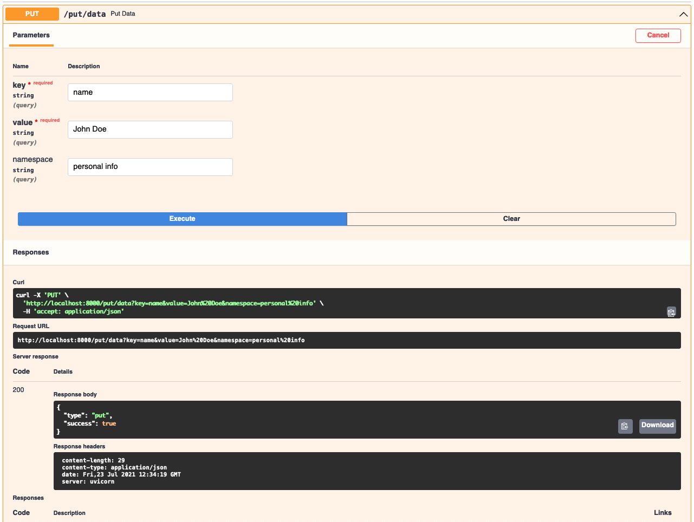
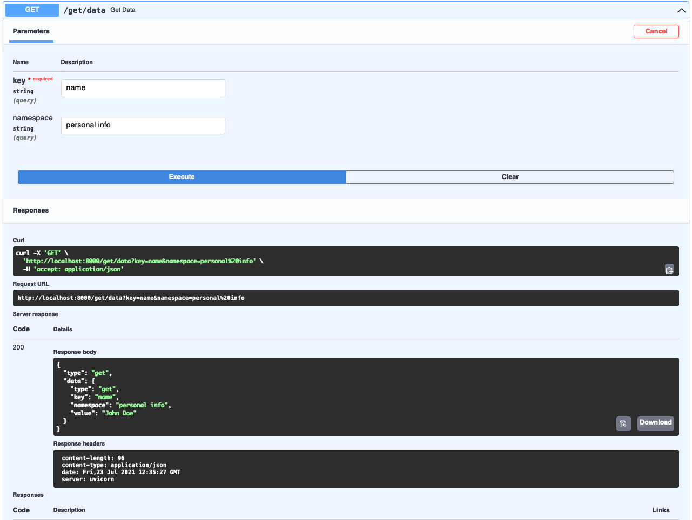

=====
Usage
=====

Start the RAFT cluster
----------------------

* Use in memory data store:

.. code-block:: console

        raftnode --ip <MY_IP:MY_PORT> --peers <PEER1:PORT1>,<PEER2:PORT2>,...,<PEERn:PORTn>

* ...OR use rocksdb database:

.. code-block:: console

        raftnode --ip <MY_IP:MY_PORT> --peers <PEER1:PORT1>,<PEER2:PORT2>,...,<PEERn:PORTn> --store database --database <DATABASE_NAME> --volume <DIRECTORY TO STORE THE DATABASE>

*raftnode* enables you to write your own client. It uses simple internet sockets to interact with the node. The IP and PORT on which we start the node is the address where each node is listening.
As long as your client supports sockets, you're good to go! Here is an example of client implementation using python fastAPI:

Let's install FastAPI and uvicorn first

.. code-block:: console

    pip install fastapi uvicorn
    
*client.py*

.. code-block:: python

    from fastapi import FastAPI, HTTPException
    from socket import socket, AF_INET, SOCK_STREAM
    import uvicorn
    import sys
    from json import loads, dumps

    app = FastAPI()
    try:
        addr = sys.argv[1]
        host = addr.split(':')[0]
        port = int(addr.split(':')[1])
    except Exception:
        raise Exception('Please pass name of atleast 1 server')

    @app.put('/put/data')
    async def put_data(key: str, value: str):
        message = {'type': 'put', 'key': key, 'value': value}
        s = socket(AF_INET, SOCK_STREAM)
        s.connect((host, port))
        s.send(encode_json(message))
        response = s.recv(1024).decode('utf-8')
        response = decode_json(response)
        s.close()
        if not response['success']:
            raise HTTPException(500, detail='Couldnt put items')
        return response

    @app.get('/get/data')
    async def put_data(key: str):
        message = {'type': 'get', 'key': key}
        s = socket(AF_INET, SOCK_STREAM)
        s.connect((host, port))
        s.send(encode_json(message))
        response = decode_json(s.recv(1024).decode('utf-8'))
        s.close()
        if not response['data']:
            raise HTTPException(500, detail='Couldnt put items')
        return response

    def encode_json(message):
        message = bytes(dumps(message), encoding='utf-8')
        return message

    def decode_json(message):
        return loads(message)

    if __name__ == '__main__':
        uvicorn.run('web:app', host='0.0.0.0', port=8000)

To run this:

.. code-block:: console

    python client.py <IP:PORT OF ANY NODE>

You can now go to http://localhost:8000/docs to browse the OpenAPI UI

* Let's try and insert some data using the */put/data* API

* Let's retrieve the data we just put using the */get/data* API

